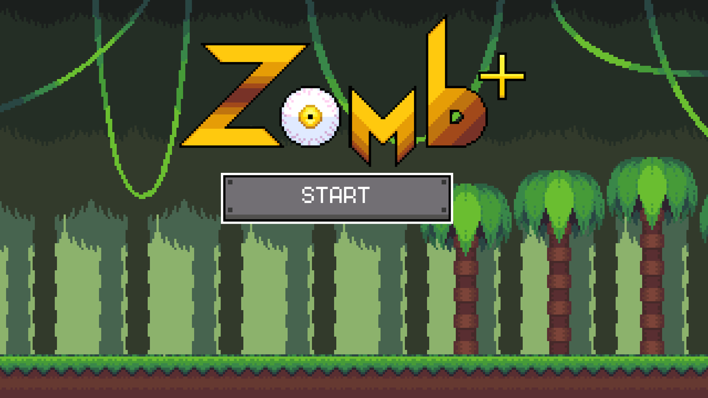
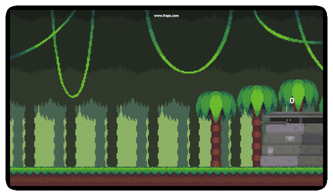

# Zomb+ #
## A maths game I made using GMM (GameMaker Studio) ##

  

# Gameplay #

  

Gameplay is pretty simple, solve mathematical equation to kill a zombie

# Controls #

Num-pad = Numbers for answers
F11 = Fullscreen mode on/off
Backspace = Delete in case number misclick
Escape = Pause screen when in game
